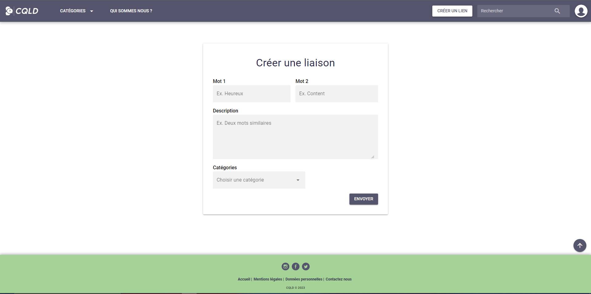

# Comment créer un lien ?

Le principe du site reste de donner des différences entre des mots que l'on pense similaire mais qui ne le sont parfois pas du tout.
Ses différences sont appelés des liens sur notre site et pour en créer, c'est très simple:

### La page de création

Après vous être connectés, il vous suffit de vous rendre sur la page de création

Une fois sur cette page, et votre sélection de mot ainsi que votre description choisis, il vous faut remplir les champs à votre disposition pour ceux-ci
Choississez ensuite la catégorie correspondante à votre choix.

Une fois tout rempli, cliquez sur Envoyer.

Votre proposition sera donc envoyé aux administrateurs qui oui ou non elle peut apparaitre sur le site. Une fois fait, celui-ci pourra être visible dans la catégorie associée.
