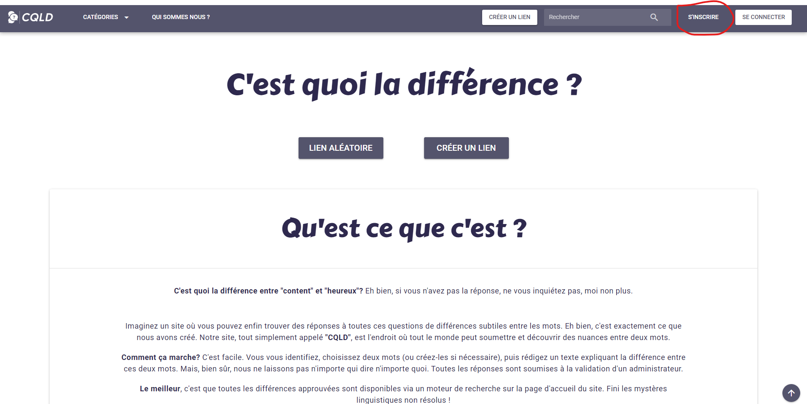
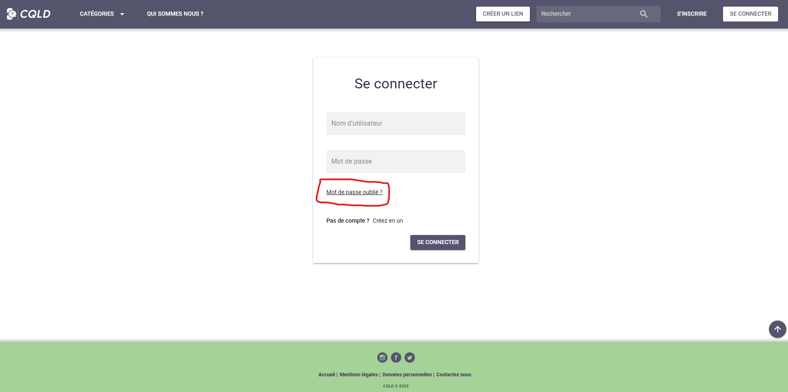

# Créer un compte

La première étape en arrivant sur le site est de se créer un compte. Cela vous permettra de naviguer librement dans le site sans être arrêté pour vous connecter à chaque action.

### Se rendre au formulaire d'inscription

Afin de s'inscrire, il faut pouvoir y avoir accès.

Une fois l'application lancé, celle-ci se lancera sur la page d'accueil. Pour vous rendre sur la page d'inscription c'est très simple. Dans le coin supérieur droit, il y a 2 boutons mais 1 nous intéresse dans notre cas, il vous faudra cliquer sur le bouton "S'inscrire".

### Remplir le formulaire

Une fois arrivé sur la page. Rien de plus simple, il vous suffit de suivre les instructions du formulaire. et de remplir chaque partie avec des informations cohérentes et auquel vous pouvez vous rattacher.

## Se connecter

Une fois inscrit, il vous suffira de vous connecter avec l'identifiant et le mot de passe que vous avez renseigné à l'inscription. 

### Mot de passe oublié

Si jamais il vous arrive d'oublier votre mot de passe et d'être sans issu, l'option de mot de passe et mise en place sur le site. Pour cela, il faudra cliquer sur le lien "Mot de passe oublié?".

Une fois fait, il suffit de suivre les instructions donnés pour récupérer votre mot de passe.
