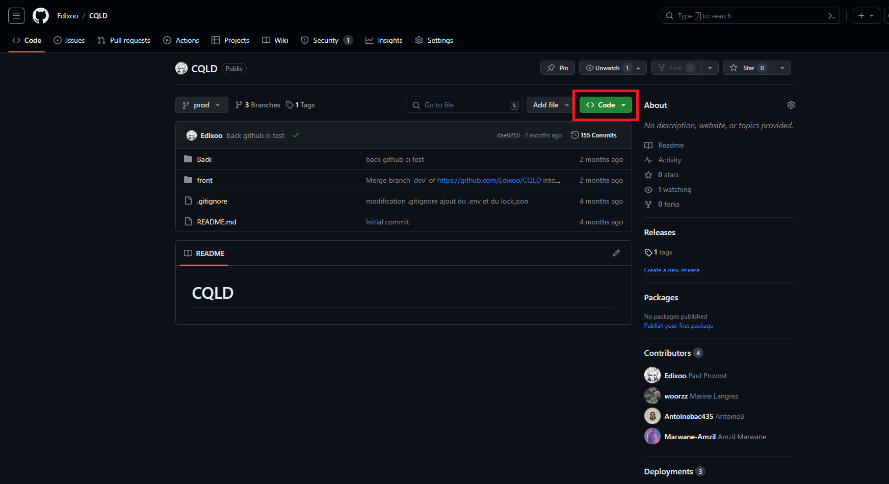

# Installation

Le projet est disponible sur GitHub à ce lien [CQLDProjet](https://github.com/Edixoo/CQLD)

## Navigation sur Github

Une fois arrivé sur la page d'accueil du projet il vous faudra cliquer sur le bouton Code:

Une fois ceci fait, un menu s'ouvrira où vous pouvez choisir votre mode d'installation:

* Clone avec Git: pour se faire il vous faudra installer le logiciel Git afin d'effectuer des commandes grâce à leur executeur. Arrivé dessus, mettez vous dans le répertoire de votre choix. Et exécuter la commande qui suit: git clone https://github.com/Edixoo/CQLD.git

* Download ZIP: Quand vous cliquez sur ce bouton, un dossier .zip se téléchargera sur votre ordinateur. Il vous suffira de le dézipper dans le répertoire de votre choix.

Une fois le site sur votre machine, nous pouvons le configurer..
