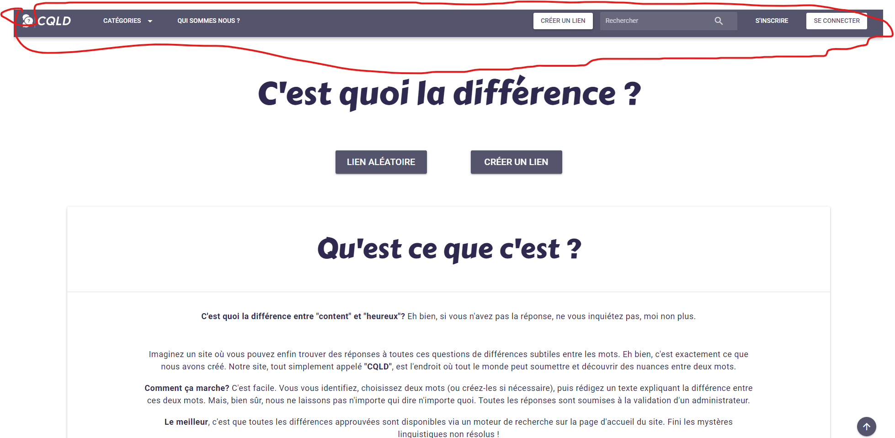

# **Naviguer sur le site**

Naviguer sur le site est très simple, les pages disponibles sont toutes disponibles (ou presque) dans votre barre en haut ou plus communément appelé Header.

Voici les différentes pages disponibles ici:

* Le logo qui permet de faire un retour à l'accueil
* Les catégories où sont contenus les liens existants déjà (ou non), des dizaines existents déjà
* Qui sommes nous ? C'est la page parlant de qui nous sommes et ce que nous faisons
* Créer un lien: c'est la page pour pouvoir créer vous même un lien, il vous faudra être connecté pour y avoir accès
* S'inscrire/se connecter, correspondant l'un et l'autre aux formulaires d'inscription et de connexion
* Lien aléatoire pour avoir accès à un lien aléatoire existant dans une catégorie également choisi aléatoirement.
* Dans le footer nous avons:
  * Les mentions légales
  * Les données personnelles qui définissent notre usage de celles ci
  * Contactez nous avec un formulaire de contact pour les utilisateurs
